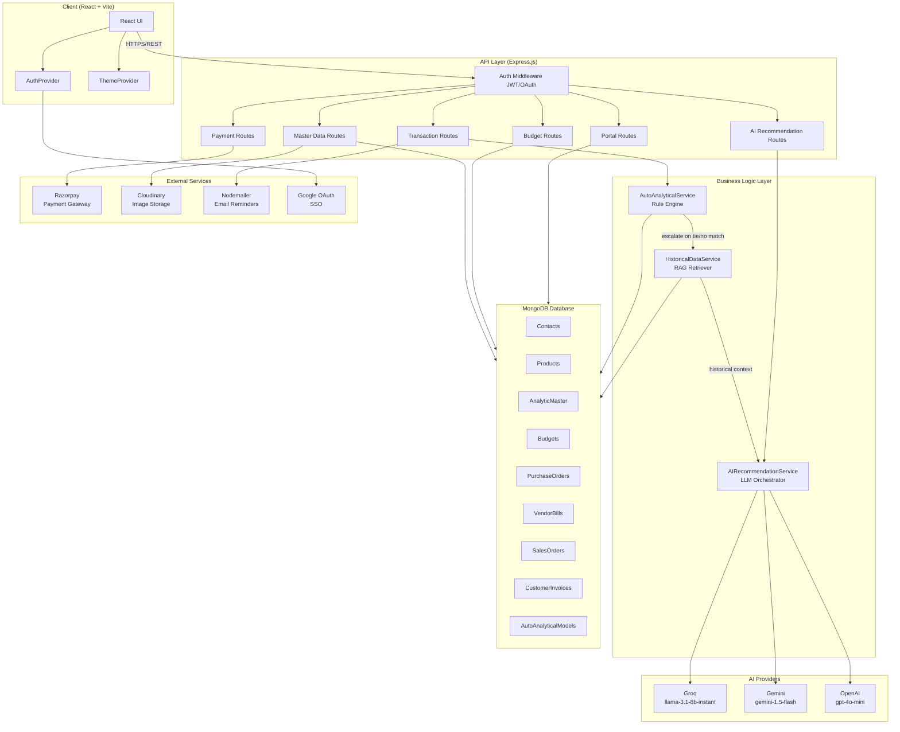
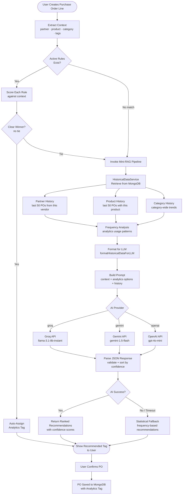
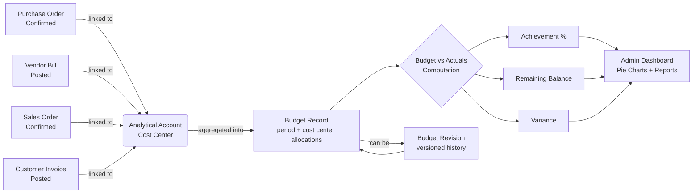
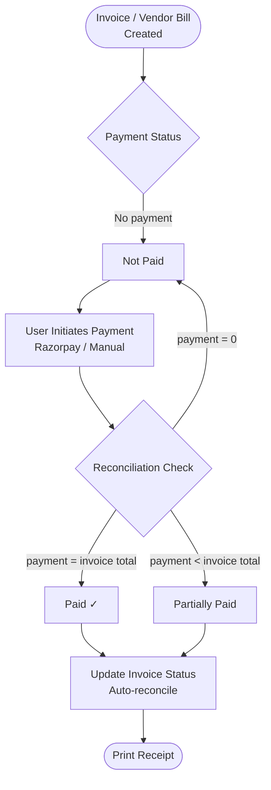
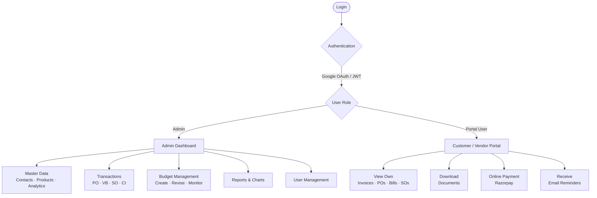

# Budget Accounting System – Shiv Furniture

> **Hackathon Submission** — A production-grade, full-stack ERP Budget Accounting System built for Shiv Furniture, featuring AI-powered cost-center recommendations via a custom mini-RAG pipeline, real-time budget monitoring, Razorpay payment integration, and a multi-role portal.

**Demo Video:** [https://youtu.be/_MkndwH45TM](https://youtu.be/_MkndwH45TM)

---

## Table of Contents

- [Problem Statement](#problem-statement)
- [Solution Overview](#solution-overview)
- [Key Features](#key-features)
- [The AI Recommendation Engine (Mini-RAG)](#the-ai-recommendation-engine-mini-rag)
- [System Architecture](#system-architecture)
- [Application Flow](#application-flow)
- [Tech Stack](#tech-stack)
- [Project Structure](#project-structure)
- [Getting Started](#getting-started)
- [Environment Variables](#environment-variables)
- [API Overview](#api-overview)

---

## Problem Statement

**Shiv Furniture** required a centralized Budget Accounting System to record purchases, sales, and payments while enabling **cost-center–wise budget monitoring**. The core challenges were:

- No structured linkage between transactions, cost centers, and budgets
- Manual effort in tracking budget utilization vs. actual spending
- Inconsistent master data usage across teams
- No real-time visibility into financial performance across business activities

---

## Solution Overview

We built a complete, multi-role ERP system from scratch in 24 hours that addresses every pain point:

| Challenge | Our Solution |
|-----------|-------------|
| Budget tracking | Real-time Budget vs. Actuals with visual pie charts and achievement % |
| Cost-center linkage | Auto Analytical Models with deterministic rule engine + AI fallback |
| Manual tagging | AI-powered analytics tag recommendations (Mini-RAG pipeline) |
| Payment tracking | Razorpay integration with auto-reconciliation (Paid / Partially Paid / Unpaid) |
| Portal access | Customer/Vendor portal with invoice viewing, download, and online payment |
| Data integrity | Archiving system preserving historical data without deletion |

---

## Key Features

### Master Data Management
- **Contacts** — Add vendors/customers with tags, photo upload (Cloudinary), and archiving
- **Products** — Product catalog with custom categories; archivable
- **Analytical Accounts (Cost Centers)** — Define where money is being spent (e.g., "Furniture Expo 2026")
- **Budgets** — Period-based budgets linked to cost centers with revision history
- **Auto Analytical Models** — Rule configurations for automatic cost-center assignment

### Transaction Processing
- **Purchase Orders** — Vendor selection, AI-recommended cost centers, confirmation & receipt printing
- **Vendor Bills** — Created from POs; paid/unpaid status; Razorpay online payment
- **Sales Orders** — Customer invoicing with due dates and email reminders
- **Customer Invoices** — Tracked with full payment status and downloadable receipts
- **Payments** — Recorded against invoices/bills with automatic reconciliation

### Budget Monitoring
- Budget vs. Actual expenditure computation
- Achievement percentage and remaining balance
- Pie chart visualizations of budget utilization
- Full revision history for each budget period

### Customer Portal
- View own invoices, bills, sales orders, and purchase orders
- Download invoice/bill documents
- Pay invoices online via Razorpay

---

## The AI Recommendation Engine (Mini-RAG)

> This is the most technically significant component of the solution.

### The Problem
When a user creates a purchase order, they need to assign an **Analytical Account (cost center)** to each line item. Doing this manually for every transaction is error-prone and time-consuming. We built an intelligent system that recommends the right cost center automatically.

### Architecture: Two-Stage Recommendation Pipeline

The system operates in two stages before presenting a recommendation:

```
┌────────────────────────────────────────────────────────────┐
│                  STAGE 1: Rule Engine                       │
│  (AutoAnalyticalService.js)                                 │
│                                                             │
│  1. Build transaction context (partnerId, productId,        │
│     productCategoryId, partnerTags)                         │
│  2. Fetch all active Auto Analytical Model rules            │
│  3. Score each rule by number of matched conditions         │
│  4. If a clear winner exists → assign it directly           │
│  5. If TIE or NO match → escalate to Stage 2                │
└────────────────────────────────────┬───────────────────────┘
                                     │  Escalation
                                     ▼
┌────────────────────────────────────────────────────────────┐
│              STAGE 2: Mini-RAG + LLM                        │
│  (HistoricalDataService.js + AIRecommendationService.js)    │
│                                                             │
│  RETRIEVAL   → Query MongoDB for historical transaction data │
│  AUGMENTATION → Format + aggregate patterns into context    │
│  GENERATION  → Feed to LLM (Groq / Gemini / OpenAI)         │
│  OUTPUT      → Ranked recommendations with confidence scores │
└────────────────────────────────────────────────────────────┘
```

### Stage 1 — Deterministic Rule Engine

The `AutoAnalyticalService` implements a **priority-scoring rule engine**:

1. **Context Building** — Resolves `partnerId` and `productId` to full objects including partner tags and product category.
2. **Rule Evaluation** — Each configured rule specifies up to 4 conditions:
   - `partnerId` — Exact vendor match
   - `partnerTagId` — Vendor must have this tag
   - `productId` — Exact product match
   - `productCategoryId` — Product's category match
3. **Scoring** — A rule scores one point per matched condition. Only rules where ALL specified conditions match are considered.
4. **Winner Selection** — Rule with the highest score wins. Tie-breaker: most recently updated rule.
5. **Escalation** — If two rules tie or no rule matches, the Stage 2 RAG pipeline is invoked.

### Stage 2 — Mini-RAG Pipeline

This is the core AI innovation. It follows the classic **Retrieve → Augment → Generate** pattern applied to ERP analytics tagging.

#### Step 1: Retrieval (`HistoricalDataService.js`)

The service performs **multi-dimensional retrieval** from MongoDB across three axes simultaneously:

```
MongoDB Collections
        │
        ├──► partnerHistory   — All POs from the same vendor (last 50)
        │                        "What analytics did we use when buying from this vendor before?"
        │
        ├──► productHistory   — All POs containing this exact product
        │                        "What analytics was assigned to this product historically?"
        │
        ├──► categoryHistory  — All POs for products in the same category
        │                        "What analytics does this product category trend towards?"
        │
        └──► recentOrders     — Last 20 POs overall (general baseline)
```

It then computes **frequency analysis** — an `analyticsUsagePatterns` object that counts how many times each cost center appeared and what percentage were auto-assigned vs. manually set.

#### Step 2: Augmentation (`HistoricalDataService.formatHistoricalDataForLLM`)

Raw MongoDB documents are transformed into a **structured, token-efficient text summary** for the LLM:

```
HISTORICAL PURCHASE DATA ANALYSIS:

SUMMARY:
- Total historical records: 42
- Partner-specific records: 15
- Product-specific records: 8
- Category-specific records: 19

VENDOR PURCHASING PATTERNS (Last 10 orders):
1. GPU → IT Infrastructure (Manual)
2. RAM Modules → IT Infrastructure (Auto)
...

THIS PRODUCT'S HISTORY (Last 5 purchases):
1. Bought from Tech Hardware Support → IT Infrastructure (Auto)
...

MOST FREQUENTLY USED ANALYTICS (Top 5):
1. IT Infrastructure - Used 23 times (65% auto-assigned)
2. Office Renovation - Used 12 times (50% auto-assigned)
...
```

This augmented context is appended to the transaction's current details (vendor name, product, category, quantity, unit price) to form the full prompt.

#### Step 3: Generation (Multi-Provider LLM)

The system supports **three LLM providers** with a configurable `AI_PROVIDER` environment variable:

| Provider | Model | Notes |
|----------|-------|-------|
| **Groq** | `llama-3.1-8b-instant` | Fastest; best performance in testing |
| **Gemini** | `gemini-1.5-flash` | Default provider |
| **OpenAI** | `gpt-4o-mini` | Highest accuracy |

The LLM is instructed to respond with a structured JSON array:

```json
[
  {
    "analyticsId": "<exact-mongo-id>",
    "analyticsName": "IT Infrastructure",
    "confidence": 0.87,
    "reason": "Vendor 'Tech Hardware' has assigned IT Infrastructure in 15/15 past purchases"
  },
  {
    "analyticsId": "<mongo-id>",
    "analyticsName": "Office Renovation",
    "confidence": 0.42,
    "reason": "Secondary pattern from same product category"
  }
]
```

Confidence scores follow a calibrated scale:
- **0.8–1.0** — Strong historical pattern (vendor frequently uses this analytics)
- **0.6–0.8** — Moderate pattern (category or product trend)
- **0.4–0.6** — Weak pattern or educated guess
- **Below 0.4** — Very uncertain, limited data

#### Step 4: Statistical Fallback

Even when AI is unavailable or disabled, the `getStatisticalRecommendations` function provides pure frequency-based recommendations using the already-retrieved historical data — ensuring graceful degradation with zero additional cost.

### Reliability by Design

- **10-second timeout** with `AbortController` on every LLM call
- **Feature flag** (`AI_RECOMMENDATION_ENABLED=true/false`) to toggle instantly
- **Graceful degradation** — any failure at Stage 2 falls back to statistical recommendations or no recommendation; it never blocks the transaction
- **Response validation** — all LLM outputs are validated for required fields; malformed responses are silently dropped

---

## System Architecture



---

## Application Flow

### Core Transaction Flow with AI Tagging



### Budget Monitoring Flow



### Payment Reconciliation Flow



### User Role & Portal Flow



---

## Tech Stack

| Layer | Technology |
|-------|-----------|
| **Frontend** | React 18, Vite, Tailwind CSS, Shadcn/ui |
| **Backend** | Node.js, Express.js |
| **Database** | MongoDB + Mongoose |
| **Authentication** | JWT, Passport.js, Google OAuth 2.0 |
| **AI / LLM** | Groq (Llama 3.1), Google Gemini 1.5 Flash, OpenAI GPT-4o Mini |
| **Payments** | Razorpay |
| **File Storage** | Cloudinary |
| **Email** | Nodemailer |
| **State Management** | React Context API |

---

## Project Structure

```
├── client/                      # React + Vite frontend
│   └── src/
│       ├── components/          # Reusable UI components
│       │   ├── master/          # Master data components
│       │   ├── portal/          # Portal-specific views
│       │   ├── purchase/        # Purchase order components
│       │   └── sale/            # Sales order components
│       ├── pages/               # Route-level page components
│       ├── context/             # AuthProvider, ThemeProvider
│       └── services/            # API call abstractions
│
└── server/                      # Express.js backend
    ├── controllers/             # Route handler logic
    ├── models/                  # Mongoose data models
    ├── routes/                  # Express route definitions
    ├── middleware/              # JWT auth middleware
    ├── services/                # Core business logic
    │   ├── AIRecommendationService.js   # LLM orchestration
    │   ├── AutoAnalyticalService.js     # Rule engine
    │   └── HistoricalDataService.js     # RAG retriever
    ├── config/                  # DB, Cloudinary, Passport config
    └── utils/                   # Mail sender, image uploader
```

---

## Getting Started

### Prerequisites
- Node.js >= 18
- MongoDB (local or Atlas)
- API keys: Groq / Gemini / OpenAI (at least one)
- Razorpay account (for payments)
- Cloudinary account (for image uploads)

### Installation

```bash
# Clone the repository
git clone <repo-url>
cd Budget_Management_System_Odoo

# Install server dependencies
cd server
npm install

# Install client dependencies
cd ../client
npm install
```

### Running the App

```bash
# Start the backend server (from /server)
npm run dev

# Start the frontend dev server (from /client)
npm run dev
```

---

## Environment Variables

Create a `.env` file in the `/server` directory:

```env
# Server
PORT=5000
MONGO_URI=mongodb://localhost:27017/budget_management
JWT_SECRET=your_jwt_secret

# Google OAuth
GOOGLE_CLIENT_ID=your_google_client_id
GOOGLE_CLIENT_SECRET=your_google_client_secret

# AI Configuration
AI_RECOMMENDATION_ENABLED=true
AI_PROVIDER=groq                  # groq | gemini | openai
GROQ_API_KEY=your_groq_api_key
GROQ_MODEL=llama-3.1-8b-instant
GEMINI_API_KEY=your_gemini_api_key
OPENAI_API_KEY=your_openai_api_key
OPENAI_MODEL=gpt-4o-mini

# Razorpay
RAZORPAY_KEY_ID=your_razorpay_key_id
RAZORPAY_KEY_SECRET=your_razorpay_key_secret

# Cloudinary
CLOUDINARY_CLOUD_NAME=your_cloud_name
CLOUDINARY_API_KEY=your_cloudinary_key
CLOUDINARY_API_SECRET=your_cloudinary_secret

# Email
MAIL_USER=your_email@gmail.com
MAIL_PASS=your_app_password

# Frontend URL (for CORS)
CLIENT_URL=http://localhost:5173
```

---

## API Overview

| Module | Endpoint Prefix | Key Operations |
|--------|----------------|----------------|
| Auth | `/api/auth` | Login, OAuth callback, JWT refresh |
| Contacts | `/api/contacts` | CRUD, archive |
| Products | `/api/products` | CRUD, archive |
| Analytic Accounts | `/api/analytic-master` | CRUD |
| Auto Analytical Models | `/api/auto-analytical-model` | Rule configuration |
| Budgets | `/api/budget` | Create, revise, monitor |
| Purchase Orders | `/api/purchase-orders` | CRUD, confirm, AI tag suggestion |
| Vendor Bills | `/api/vendor-bills` | CRUD, payment status |
| Sales Orders | `/api/sales-orders` | CRUD, confirm |
| Customer Invoices | `/api/customer-invoices` | CRUD, payment status |
| Payments | `/api/payments` | Create, reconcile |
| Portal | `/api/portal` | Customer-facing views |
| AI Recommendation | `/api/auto-analytical-model/recommend` | Trigger AI suggestion |
| File Upload | `/api/upload` | Cloudinary upload |

---

## Key Concepts

### Analytical Accounts (Cost Centers)
Unlike the Chart of Accounts (which tracks *what* money is for, e.g. "Electricity"), Analytical Accounts track *where or on what activity* the money is spent — e.g., "Furniture Expo 2026" as a cost center within the "Marketing" general account.

### Budget vs. Actuals
The heart of the project. Actuals are pulled from posted/confirmed transaction entries. The system computes:
- **Variance** = Budget − Actual
- **Achievement %** = (Actual / Budget) × 100

### Auto Analytical Models
Pre-configured rules (e.g., "any product in category 'Wood' → 'Production' analytical account") that the rule engine uses to automatically link transactions to cost centers without manual intervention.

### Payment Reconciliation
The handshake between a payment record and an invoice/bill:
- **Fully Paid** — payment ≥ invoice total
- **Partially Paid** — payment < invoice total, balance remains
- **Not Paid** — no payment recorded

---

*Built in 24 hours for the Odoo Hackathon — Feb 2026*
